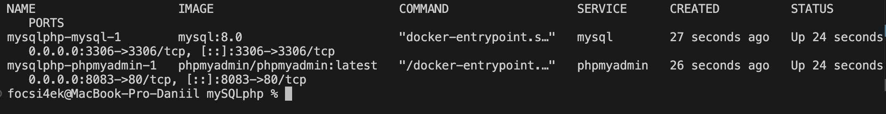
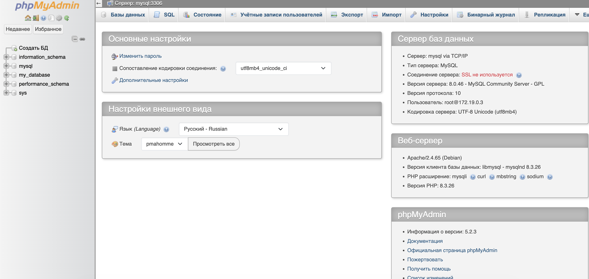
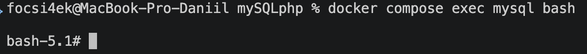

# 🚀 Развертывание MySQL и phpMyAdmin с использованием Docker Compose

**Автор:** Абрамов Даниил Сергеевич

Проект демонстрирует развертывание базы данных **MySQL** и веб-интерфейса **phpMyAdmin** с использованием **Docker Compose**.

**phpMyAdmin** — веб-приложение с открытым исходным кодом на PHP, предназначенное для администрирования MySQL и MariaDB через браузер.

С помощью phpMyAdmin можно:

- создавать и удалять базы данных
- создавать таблицы
- добавлять и изменять записи
- выполнять SQL-запросы
- импортировать и экспортировать данные
- управлять пользователями и правами доступа

В результате запускаются два контейнера:

- **MySQL** — сервер базы данных
- **phpMyAdmin** — веб-интерфейс для управления базой данных

После запуска phpMyAdmin будет доступен по адресу:

[http://localhost:8083](http://localhost:8083)

---

## 📋 Требования

Перед началом работы необходимо убедиться, что установлен и запущен **Docker Desktop**.

Проверить существующие Docker Compose-проекты можно командой:

    docker compose ls

Если другие проекты уже запущены, рекомендуется проверить используемые ими порты, чтобы избежать конфликтов.

---

## 📁 1. Создание проекта

Структура проекта:

    mysql-pma-app/
    ├── README.md
    ├── compose.yaml
    ├── 01-mysql-pma-docker-ps.png
    ├── 02-phpmyadmin-login.png
    ├── 03-phpmyadmin-dashboard.png
    └── 04-mysql-container-bash.png

Создание директории проекта и файла конфигурации через терминал macOS:

    mkdir -p mysql-pma-app
    cd mysql-pma-app
    touch compose.yaml

Также можно выполнить всё одной командой:

    mkdir -p mysql-pma-app && cd mysql-pma-app && touch compose.yaml

---

## ⚙️ 2. Настройка compose.yaml

Содержимое файла:

    services:

      mysql:
        platform: linux/amd64
        image: mysql:8.0
        restart: unless-stopped
        environment:
          MYSQL_ROOT_PASSWORD: root
          MYSQL_DATABASE: my_database
          MYSQL_USER: my_user
          MYSQL_PASSWORD: my_password
        ports:
          - 3306:3306
        volumes:
          - mysql_data:/var/lib/mysql
        networks:
          - mysql-pma-network

      phpmyadmin:
        platform: linux/amd64
        depends_on:
          - mysql
        image: phpmyadmin/phpmyadmin:latest
        ports:
          - 8083:80
        restart: unless-stopped
        environment:
          PMA_HOST: mysql
          PMA_PORT: 3306
          PMA_ARBITRARY: 1
          UPLOAD_LIMIT: 300M
        networks:
          - mysql-pma-network

    networks:
      mysql-pma-network:

    volumes:
      mysql_data:

### Используемые сервисы

| Сервис | Docker-образ | Назначение |
|---|---|---|
| mysql | mysql:8.0 | Сервер базы данных |
| phpmyadmin | phpmyadmin/phpmyadmin:latest | Веб-интерфейс управления MySQL |

Порт 3306 контейнера MySQL пробрасывается на локальный порт 3306.

Порт 80 контейнера phpMyAdmin пробрасывается на локальный порт 8083.

> ⚠️ Логины и пароли в данном проекте используются в учебных целях. В реальном проекте конфиденциальные данные рекомендуется хранить отдельно, например в файле .env.

---

## ▶️ 3. Запуск проекта

В директории проекта необходимо выполнить:

    docker compose up -d

Параметр -d запускает контейнеры в фоновом режиме.

Проверить состояние контейнеров можно командой:

    docker compose ps

После успешного запуска оба контейнера должны иметь статус Up.

### Статус запущенных контейнеров

---

## 🌐 4. Доступ к phpMyAdmin

После запуска контейнеров необходимо открыть браузер и перейти по адресу:

[http://localhost:8083](http://localhost:8083)

Откроется страница авторизации phpMyAdmin.

### Данные для входа

| Параметр | Значение |
|---|---|
| Сервер | mysql |
| Пользователь | root |
| Пароль | root |

### Окно авторизации

После успешного входа откроется панель управления базами данных.

### Панель управления phpMyAdmin

---

## 🗄️ Созданная база данных

При первом запуске MySQL автоматически создаётся база данных:

    my_database

Также создаётся пользователь:

    my_user

Пароль пользователя:

    my_password

Данные задаются в разделе environment файла compose.yaml.

---

## 🛠️ 5. Управление проектом

Все команды необходимо выполнять из директории mysql-pma-app.

### Просмотр состояния контейнеров

    docker compose ps

### Просмотр логов phpMyAdmin

    docker compose logs -f phpmyadmin

Для выхода из просмотра логов:

    Ctrl + C

### Просмотр логов MySQL

    docker compose logs -f mysql

Для выхода:

    Ctrl + C

### Остановка контейнеров

    docker compose stop

При остановке контейнеров данные базы сохраняются.

### Запуск остановленных контейнеров

    docker compose start

### Перезапуск проекта

    docker compose restart

---

## 💻 Вход в контейнер MySQL

Для открытия терминала внутри контейнера MySQL выполнить:

    docker compose exec mysql bash

После выполнения команды откроется командная строка внутри контейнера.

### Терминал контейнера MySQL

Для выхода из контейнера выполнить:

    exit

---

## 🏗️ Архитектура проекта

                  ┌─────────────────────┐
                  │       Browser       │
                  └──────────┬──────────┘
                             │
                    localhost:8083
                             │
                             ▼
                  ┌─────────────────────┐
                  │     phpMyAdmin      │
                  │  phpmyadmin:latest  │
                  │       port 80       │
                  └──────────┬──────────┘
                             │
                    mysql-pma-network
                             │
                             ▼
                  ┌─────────────────────┐
                  │       MySQL         │
                  │     mysql:8.0       │
                  │     port 3306       │
                  └─────────────────────┘
                             │
                             ▼
                  ┌─────────────────────┐
                  │     mysql_data      │
                  │    Docker Volume    │
                  └─────────────────────┘

---

## 🗑️ 6. Удаление проекта

Для остановки контейнеров и удаления всех созданных Docker volumes выполнить:

    docker compose down -v

Параметр -v удаляет том mysql_data.

Это означает, что все данные MySQL будут полностью удалены.

После этого можно удалить директорию проекта:

    cd ..
    rm -rf mysql-pma-app

---

## 📌 Итог

В рамках проекта были развернуты **MySQL** и **phpMyAdmin** с использованием Docker Compose.

Были настроены:

- контейнер MySQL
- контейнер phpMyAdmin
- внутренняя Docker-сеть
- постоянное хранение данных через Docker volume
- автоматическое создание базы данных
- автоматическое создание пользователя MySQL
- доступ к MySQL через порт 3306
- доступ к phpMyAdmin через порт 8083
- возможность работы с MySQL через браузер
- возможность входа непосредственно в терминал контейнера MySQL

Использование Docker позволяет быстро развернуть готовую среду MySQL и phpMyAdmin без ручной установки сервисов на операционную систему.

---

**Автор:** Абрамов Даниил Сергеевич