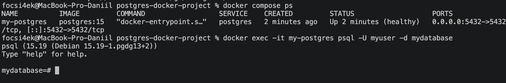
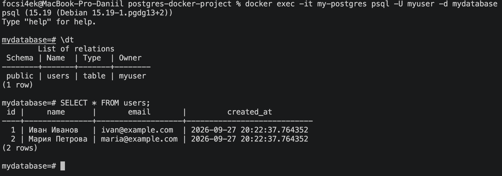
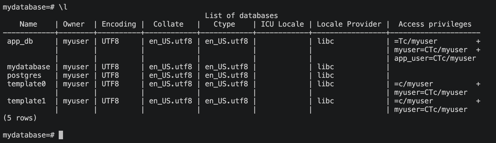

# 🐘 Развертывание PostgreSQL с использованием Docker Compose

**Автор:** Абрамов Даниил Сергеевич

Проект демонстрирует развертывание **PostgreSQL 15** в Docker-контейнере с использованием **Docker Compose**.

**PostgreSQL** — свободная объектно-реляционная система управления базами данных с открытым исходным кодом.

В рамках проекта выполняются:

- запуск PostgreSQL в Docker-контейнере
- автоматическое создание базы данных
- создание пользователя
- выполнение SQL-скрипта при первом запуске
- создание тестовой таблицы
- добавление тестовых данных
- постоянное хранение данных
- проверка состояния контейнера через healthcheck

---

## 📋 Требования

Перед началом работы необходимо убедиться, что установлен и запущен **Docker Desktop**.

Проверить существующие Docker Compose-проекты можно командой:

    docker compose ls

Если другие проекты уже запущены, рекомендуется проверить используемые ими порты, чтобы избежать конфликтов.

PostgreSQL по умолчанию использует порт 5432.

---

## 📁 1. Структура проекта

Структура проекта:

    postgres-docker-project/
    ├── README.md
    ├── docker-compose.yml
    ├── 01-postgres-docker-ps.png
    ├── 02-postgres-users-table.png
    ├── 03-postgres-databases.png
    ├── data/
    ├── backups/
    └── scripts/
        └── init.sql

Назначение основных элементов:

| Элемент | Назначение |
|---|---|
| docker-compose.yml | Конфигурация Docker Compose |
| data | Хранение файлов PostgreSQL |
| scripts | SQL-скрипты инициализации |
| backups | Каталог для резервных копий |
| init.sql | Автоматическое создание БД, пользователя и тестовых данных |

Создание структуры проекта:

    mkdir -p postgres-docker-project/{data,scripts,backups} && \
    touch postgres-docker-project/docker-compose.yml postgres-docker-project/scripts/init.sql && \
    cd postgres-docker-project

---

## ⚙️ 2. Настройка docker-compose.yml

Содержимое файла docker-compose.yml:

    services:
      postgres:
        image: postgres:15
        container_name: my-postgres
        environment:
          POSTGRES_DB: mydatabase
          POSTGRES_USER: myuser
          POSTGRES_PASSWORD: mypassword
        ports:
          - 5432:5432
        volumes:
          - ./data:/var/lib/postgresql/data
          - ./scripts/init.sql:/docker-entrypoint-initdb.d/init.sql
          - ./backups:/backups
        restart: unless-stopped
        healthcheck:
          test: ["CMD-SHELL", "pg_isready -U myuser -d mydatabase"]
          interval: 30s
          timeout: 10s
          retries: 3

### Основные параметры

| Параметр | Значение |
|---|---|
| Docker-образ | postgres:15 |
| Имя контейнера | my-postgres |
| Основная база | mydatabase |
| Пользователь | myuser |
| Пароль | mypassword |
| Порт | 5432 |
| Политика перезапуска | unless-stopped |

Папка data используется для постоянного хранения файлов базы данных.

SQL-скрипт init.sql автоматически выполняется при первой инициализации PostgreSQL.

---

## 🗄️ 3. Настройка scripts/init.sql

Содержимое файла:

    CREATE DATABASE app_db;

    CREATE USER app_user WITH PASSWORD 'app_password';

    GRANT ALL PRIVILEGES ON DATABASE app_db TO app_user;

    \c mydatabase;

    CREATE TABLE IF NOT EXISTS users (
        id SERIAL PRIMARY KEY,
        name VARCHAR(100) NOT NULL,
        email VARCHAR(100) UNIQUE NOT NULL,
        created_at TIMESTAMP DEFAULT CURRENT_TIMESTAMP
    );

    INSERT INTO users (name, email) VALUES
    ('Иван Иванов', 'ivan@example.com'),
    ('Мария Петрова', 'maria@example.com')
    ON CONFLICT (email) DO NOTHING;

При первом запуске данный скрипт:

- создаёт дополнительную базу app_db
- создаёт пользователя app_user
- выдаёт ему права на app_db
- подключается к mydatabase
- создаёт таблицу users
- добавляет две тестовые записи

---

## ▶️ 4. Запуск PostgreSQL

Перед запуском можно проверить конфигурацию проекта:

    docker compose config

Запуск контейнера в фоновом режиме:

    docker compose up -d

Параметр -d означает запуск в фоновом режиме.

Проверить состояние контейнера:

    docker compose ps

После успешного запуска контейнер должен иметь статус Up и затем healthy.

### Статус контейнера PostgreSQL

---

## 📜 5. Проверка логов

Посмотреть логи PostgreSQL:

    docker compose logs postgres

При успешном запуске в логах должна появиться информация о завершении процесса инициализации и готовности PostgreSQL принимать подключения.

Для просмотра логов в реальном времени:

    docker compose logs -f postgres

Для выхода:

    Ctrl + C

---

## 💻 6. Подключение к PostgreSQL

Для подключения к базе данных внутри контейнера:

    docker exec -it my-postgres psql -U myuser -d mydatabase

После выполнения команды откроется консоль PostgreSQL.

Проверить список таблиц:

    \dt

В результате должна отображаться таблица users.

Для просмотра содержимого таблицы:

    SELECT * FROM users;

В таблице должны находиться две тестовые записи:

| id | name | email |
|---|---|---|
| 1 | Иван Иванов | ivan@example.com |
| 2 | Мария Петрова | maria@example.com |

### Таблица users и тестовые данные

---

## 🗃️ 7. Проверка созданных баз данных

Находясь в консоли PostgreSQL, выполнить:

    \l

В списке баз данных должны присутствовать:

- mydatabase
- app_db
- postgres
- template0
- template1

### Список баз данных

Для выхода из консоли PostgreSQL:

    \q

---

## 🔌 Подключение к PostgreSQL

PostgreSQL доступен на локальном компьютере по адресу:

    localhost:5432

При этом открыть localhost:5432 в обычном браузере нельзя.

PostgreSQL использует собственный протокол взаимодействия с базой данных, а не HTTP.

Поэтому сообщение браузера о том, что соединение установлено, но сервер ничего не отправил, является нормальным поведением.

Для работы с PostgreSQL используются:

- psql
- DBeaver
- DataGrip
- pgAdmin
- другие клиенты PostgreSQL

---

## 🛠️ 8. Управление контейнером

Все команды необходимо выполнять из директории postgres-docker-project.

### Просмотр состояния

    docker compose ps

### Просмотр всех контейнеров

    docker ps -a

### Остановка контейнера без удаления

    docker compose stop

Данные базы при этом сохраняются.

### Повторный запуск

    docker compose start

### Перезапуск

    docker compose restart

### Запуск проекта

    docker compose up -d

### Просмотр итоговой конфигурации

    docker compose config

---

## 💾 9. Хранение данных

В данном проекте используется привязка локальной папки:

    ./data:/var/lib/postgresql/data

Поэтому файлы PostgreSQL сохраняются в каталоге data внутри проекта.

При выполнении:

    docker compose down

контейнер будет удалён, но данные останутся в папке data.

Даже команда:

    docker compose down -v

не удалит содержимое папки data, поскольку здесь используется локальная директория, а не именованный Docker volume.

Для полного удаления базы необходимо удалить папку data вручную.

---

## 🗑️ 10. Удаление проекта

Перейти в каталог проекта:

    cd ~/Docker/postgres-docker-project

Остановить и удалить контейнер и созданную сеть:

    docker compose down

Проверить контейнеры:

    docker ps -a

Проверить сети:

    docker network ls

При необходимости удалить сохранённые данные PostgreSQL:

    rm -rf data

После этого можно удалить весь проект:

    cd ..
    rm -rf postgres-docker-project

> ⚠️ Удаление каталога data приведёт к полной потере данных базы PostgreSQL.

---

## 🧹 11. Удаление Docker-образа

Просмотреть доступные образы:

    docker images

Для удаления образа PostgreSQL:

    docker rmi postgres:15

Также можно удалить все неиспользуемые Docker-образы:

    docker image prune -a

После удаления образ можно снова загрузить автоматически командой:

    docker compose up -d

---

## 🏗️ Архитектура проекта

                  ┌──────────────────────┐
                  │      PostgreSQL      │
                  │     postgres:15      │
                  │      port 5432       │
                  └──────────┬───────────┘
                             │
          ┌──────────────────┼──────────────────┐
          │                  │                  │
          ▼                  ▼                  ▼
       data/              scripts/           backups/
          │                  │                  │
          │               init.sql              │
          │                                     │
          └── данные БД               резервные копии

---

## 📌 Итог

В рамках проекта был развернут сервер **PostgreSQL 15** с использованием Docker Compose.

Были выполнены:

- создание Docker-контейнера PostgreSQL
- настройка порта 5432
- создание базы mydatabase
- создание дополнительной базы app_db
- создание пользователей myuser и app_user
- автоматическая инициализация через init.sql
- создание таблицы users
- добавление тестовых данных
- настройка постоянного хранения данных
- настройка healthcheck
- проверка работы базы через psql
- проверка сохранности данных после остановки контейнера

Docker позволяет быстро разворачивать PostgreSQL в изолированном окружении без необходимости устанавливать сервер базы данных непосредственно в операционную систему.

---

**Автор:** Абрамов Даниил Сергеевич