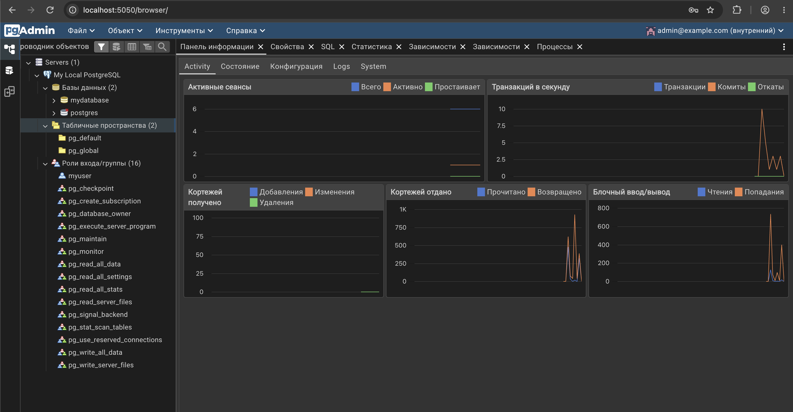

# 🐘 PostgreSQL + pgAdmin в Docker Compose

**Автор:** Абрамов Даниил Сергеевич

Проект демонстрирует развертывание базы данных **PostgreSQL 17** и веб-интерфейса **pgAdmin 4** с использованием **Docker Compose**.

В результате запускаются два изолированных Docker-контейнера:

- 🐘 **PostgreSQL** — сервер базы данных
- 🖥️ **pgAdmin 4** — веб-интерфейс для администрирования PostgreSQL

После запуска pgAdmin доступен в браузере:

[http://localhost:5050](http://localhost:5050)

---

## 📋 Требования

Перед началом работы необходимо установить и запустить:

- Docker Desktop
- Docker Compose

Проверить уже запущенные Compose-проекты:

    docker compose ls

Также рекомендуется проверить работающие контейнеры:

    docker ps

PostgreSQL использует локальный порт 5432, поэтому другой контейнер PostgreSQL на этом порту необходимо предварительно остановить.

Например:

    docker stop my-postgres

---

## 📁 1. Структура проекта

Структура проекта:

    postgres-pgadmin-app/
    ├── README.md
    ├── compose.yaml
    ├── 01-postgres-pgadmin-docker-ps.png
    └── 02-pgadmin-dashboard.png

Создание директории проекта:

    mkdir -p postgres-pgadmin-app
    cd postgres-pgadmin-app
    touch compose.yaml

---

## ⚙️ 2. Настройка compose.yaml

Содержимое файла compose.yaml:

    services:
      postgres:
        image: postgres:17-alpine
        container_name: postgres-db
        environment:
          POSTGRES_USER: myuser
          POSTGRES_PASSWORD: mypassword
          POSTGRES_DB: mydatabase
        ports:
          - 5432:5432
        volumes:
          - postgres_data:/var/lib/postgresql/data
        restart: unless-stopped

      pgadmin:
        image: dpage/pgadmin4:latest
        container_name: pgadmin-web
        depends_on:
          - postgres
        environment:
          PGADMIN_DEFAULT_EMAIL: admin@example.com
          PGADMIN_DEFAULT_PASSWORD: admin
        ports:
          - 5050:80
        restart: unless-stopped

    volumes:
      postgres_data:

---

## 🧩 Используемые сервисы

| Сервис | Docker-образ | Назначение |
|---|---|---|
| postgres | postgres:17-alpine | Сервер PostgreSQL |
| pgadmin | dpage/pgadmin4:latest | Веб-интерфейс администрирования |

### Используемые порты

| Сервис | Локальный порт | Порт контейнера |
|---|---:|---:|
| PostgreSQL | 5432 | 5432 |
| pgAdmin | 5050 | 80 |

---

## ▶️ 3. Запуск проекта

Проверить корректность конфигурации:

    docker compose config

Запустить все сервисы в фоновом режиме:

    docker compose up -d

Параметр -d запускает контейнеры в фоне.

Проверить состояние:

    docker compose ps -a

После успешного запуска должны отображаться два контейнера:

    postgres-db
    pgadmin-web

Оба контейнера должны иметь статус Up.

### Состояние контейнеров

---

## 🌐 4. Вход в pgAdmin

Открыть в браузере:

[http://localhost:5050](http://localhost:5050)

Для входа использовать:

| Поле | Значение |
|---|---|
| Email | admin@example.com |
| Password | admin |

После авторизации откроется главная страница pgAdmin.

---

## 🔌 5. Подключение pgAdmin к PostgreSQL

В pgAdmin необходимо нажать:

**Добавить новый сервер**

### Вкладка Общие

В поле имени указать:

    My Local PostgreSQL

Это отображаемое имя подключения внутри pgAdmin.

---

### Вкладка Соединение

Необходимо указать следующие параметры:

| Параметр | Значение |
|---|---|
| Имя/адрес сервера | postgres |
| Порт | 5432 |
| База данных обслуживания | mydatabase |
| Имя пользователя | myuser |
| Пароль | mypassword |

Также можно включить опцию сохранения пароля.

После заполнения параметров нажать **Сохранить**.

> В поле имени сервера используется postgres — это имя сервиса PostgreSQL внутри Docker Compose. Не нужно указывать localhost.

---

## ✅ 6. Результат подключения

После успешного подключения сервер появится в левой панели pgAdmin:

    Servers
      └── My Local PostgreSQL
          └── Databases
              ├── mydatabase
              └── postgres

В интерфейсе также доступны:

- список баз данных
- пользователи и роли
- схемы
- таблицы
- SQL Query Tool
- статистика сервера
- просмотр активных подключений

### Рабочая панель pgAdmin

На скриншоте видно:

- подключенный сервер My Local PostgreSQL
- базу mydatabase
- системную базу postgres
- пользователя myuser
- статистику работающего сервера PostgreSQL

---

## 🛠️ 7. Полезные команды

Все команды выполняются из директории postgres-pgadmin-app.

### Состояние контейнеров

    docker compose ps

### Список всех контейнеров

    docker ps -a

### Логи PostgreSQL

    docker compose logs -f postgres

Для выхода:

    Ctrl + C

### Логи pgAdmin

    docker compose logs -f pgadmin

Для выхода:

    Ctrl + C

### Остановка контейнеров

    docker compose stop

Контейнеры остановятся, но данные сохранятся.

### Повторный запуск

    docker compose start

### Перезапуск

    docker compose restart

### Просмотр конфигурации

    docker compose config

---

## 💻 8. Работа с PostgreSQL через терминал

Можно открыть командную оболочку контейнера PostgreSQL:

    docker compose exec postgres sh

Для выхода:

    exit

Также можно сразу запустить клиент PostgreSQL:

    docker compose exec postgres psql -U myuser -d mydatabase

После этого откроется консоль PostgreSQL.

Например, посмотреть список баз данных:

    \l

Выход из psql:

    \q

---

## 💾 9. Хранение данных

Для хранения данных используется именованный Docker volume:

    postgres_data

Он подключается к каталогу PostgreSQL внутри контейнера:

    /var/lib/postgresql/data

Это позволяет сохранять базы данных после остановки и пересоздания контейнера.

Обычная команда:

    docker compose down

удалит контейнеры и сеть, но **не удалит данные PostgreSQL**.

---

## 🗑️ 10. Полное удаление проекта

Для остановки и удаления контейнеров:

    docker compose down

Если необходимо удалить также все данные PostgreSQL:

    docker compose down -v

> ⚠️ Параметр -v удаляет Docker volume postgres_data. Все базы данных этого проекта будут потеряны.

После удаления Docker-ресурсов выйти из директории:

    cd ..

Удалить каталог проекта:

    rm -rf postgres-pgadmin-app

---

## 🔍 Проверка удаления

Убедиться, что контейнеры удалены:

    docker ps -a

Проверить Docker volumes:

    docker volume ls

Проверить сети:

    docker network ls

Контейнеры postgres-db и pgadmin-web после удаления проекта отображаться не должны.

---

## 🏗️ Архитектура

                  ┌──────────────────────┐
                  │       Browser        │
                  │   localhost:5050     │
                  └──────────┬───────────┘
                             │
                             ▼
                  ┌──────────────────────┐
                  │       pgAdmin 4      │
                  │ dpage/pgadmin4       │
                  │       port 80        │
                  └──────────┬───────────┘
                             │
                      Docker Network
                             │
                             ▼
                  ┌──────────────────────┐
                  │     PostgreSQL 17    │
                  │ postgres:17-alpine   │
                  │      port 5432       │
                  └──────────┬───────────┘
                             │
                             ▼
                  ┌──────────────────────┐
                  │    postgres_data     │
                  │    Docker Volume     │
                  └──────────────────────┘

---

## ⚠️ Возможные проблемы

### Порт 5432 уже занят

Если при запуске появляется сообщение:

    Bind for 0.0.0.0:5432 failed: port is already allocated

значит порт 5432 уже используется другим контейнером.

Проверить контейнеры:

    docker ps

Остановить предыдущий PostgreSQL:

    docker stop my-postgres

После этого повторить запуск:

    docker compose up -d

---

### pgAdmin не подключается к PostgreSQL

Для подключения из pgAdmin необходимо использовать:

    Host: postgres

а не localhost.

Причина в том, что PostgreSQL и pgAdmin работают в отдельных контейнерах и взаимодействуют через внутреннюю сеть Docker Compose.

Если контейнеры были пересозданы, а в браузере появилась ошибка CSRF, достаточно обновить страницу:

[http://localhost:5050](http://localhost:5050)

При необходимости можно перезапустить pgAdmin:

    docker compose restart pgadmin

---

## 📌 Итог

В рамках проекта были развернуты **PostgreSQL 17** и **pgAdmin 4** с использованием Docker Compose.

Были настроены:

- контейнер PostgreSQL
- контейнер pgAdmin
- база данных mydatabase
- пользователь myuser
- постоянное хранение данных через Docker volume
- внутреннее сетевое взаимодействие контейнеров
- доступ к PostgreSQL через порт 5432
- доступ к pgAdmin через порт 5050
- подключение pgAdmin к PostgreSQL
- графическое администрирование базы данных через браузер

Использование Docker Compose позволяет быстро развернуть полноценную среду PostgreSQL с удобной веб-панелью администрирования без ручной установки PostgreSQL и pgAdmin в операционную систему.

---

### 🎯 Результат

PostgreSQL работает в отдельном контейнере, данные сохраняются в Docker volume, а управление сервером выполняется через веб-интерфейс pgAdmin.

**Автор: Абрамов Даниил Сергеевич**