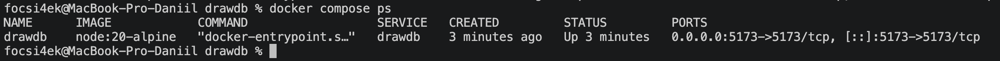
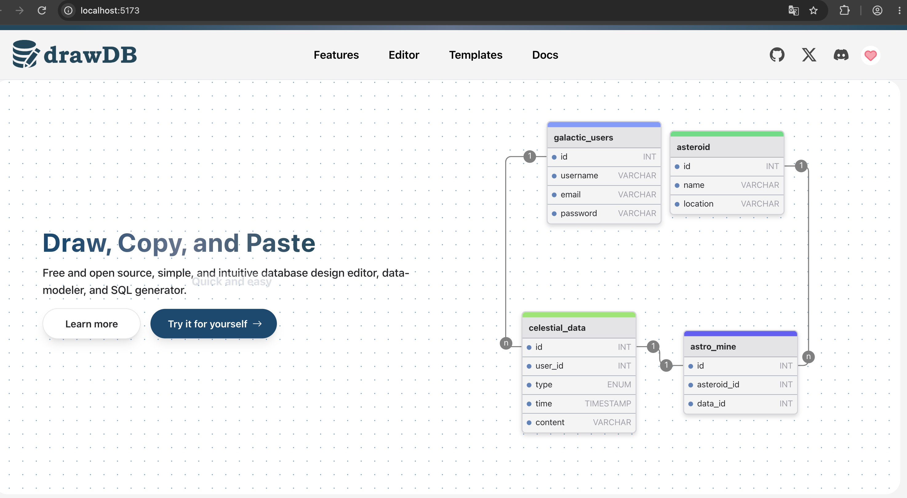

# 🗄️ Развертывание drawDB с использованием Docker Compose

**Автор:** Абрамов Даниил Сергеевич

Проект демонстрирует локальное развертывание **drawDB** с использованием **Docker Compose**.

**drawDB** — бесплатный веб-инструмент с открытым исходным кодом для проектирования баз данных. Он позволяет визуально создавать таблицы и связи между ними, строить ER-диаграммы и генерировать SQL-код прямо в браузере.

Официальный репозиторий проекта:

https://github.com/drawdb-io/drawdb

После запуска drawDB будет доступен по адресу:

http://localhost:5173

---

## 📋 Требования

Перед началом работы необходимо убедиться, что установлены и запущены:

- Docker Desktop
- Docker Compose
- Git

Проверить существующие Docker Compose-проекты:

    docker compose ls

Проверить запущенные контейнеры:

    docker ps

Если порт 5173 уже используется другим приложением, его необходимо освободить перед запуском drawDB.

---

## 📥 1. Получение drawDB

Перейти в домашний каталог:

    cd ~

Клонировать официальный репозиторий drawDB:

    git clone https://github.com/drawdb-io/drawdb.git

После клонирования будет создан каталог:

    ~/drawdb

Перейти в него:

    cd drawdb

Проверить содержимое:

    ls

В проекте должны присутствовать основные файлы, включая:

    compose.yml
    Dockerfile
    README.md
    package.json
    src

### Альтернативное клонирование

Если при обычном клонировании возникают проблемы с соединением, можно загрузить только актуальную версию репозитория:

    git -c http.version=HTTP/1.1 clone --depth 1 https://github.com/drawdb-io/drawdb.git

Параметр --depth 1 позволяет не загружать всю историю изменений Git и уменьшает объём скачиваемых данных.

---

## ⚙️ 2. Docker Compose

В официальном репозитории уже присутствует готовый файл:

    compose.yml

Он запускает drawDB внутри Docker-контейнера на базе Node.js.

Основные параметры проекта:

| Параметр | Значение |
|---|---|
| Сервис | drawdb |
| Docker-образ | node:20-alpine |
| Контейнер | drawdb |
| Локальный порт | 5173 |
| Порт приложения | 5173 |
| Рабочая директория | /var/www/html |

Каталог проекта подключается внутрь контейнера, поэтому приложение запускается непосредственно из клонированных исходников.

---

## ▶️ 3. Запуск drawDB

Находясь внутри каталога drawdb, выполнить:

    docker compose up -d

Параметр -d запускает контейнер в фоновом режиме.

При первом запуске Docker:

- загрузит образ Node.js
- создаст Docker-сеть
- создаст контейнер drawdb
- установит npm-зависимости
- запустит веб-приложение

Первый запуск может занять несколько минут.

---

## 🔍 4. Проверка контейнера

Проверить состояние:

    docker compose ps

Контейнер drawdb должен иметь статус Up.

Также можно посмотреть все активные Compose-проекты:

    docker compose ls

### Статус Docker-контейнера

---

## 🌐 5. Работа с drawDB

После успешного запуска открыть в браузере:

http://localhost:5173

Если страница сразу не появилась, необходимо немного подождать и обновить браузер, поскольку при первом запуске внутри контейнера устанавливаются зависимости проекта.

### Интерфейс drawDB

Веб-интерфейс позволяет:

- создавать таблицы
- добавлять поля и выбирать типы данных
- создавать связи между таблицами
- строить ER-диаграммы
- импортировать структуры баз данных
- экспортировать диаграммы
- генерировать SQL-код

---

## 🛠️ 6. Управление проектом

Просмотреть состояние контейнера:

    docker compose ps

Просмотреть логи:

    docker compose logs

Просматривать логи в реальном времени:

    docker compose logs -f

Для выхода из режима просмотра логов:

    Ctrl + C

Остановить контейнер без удаления:

    docker compose stop

Снова запустить:

    docker compose start

Перезапустить:

    docker compose restart

Посмотреть итоговую конфигурацию Docker Compose:

    docker compose config

---

## ⏹️ 7. Остановка проекта

Для остановки и удаления контейнера и созданной Docker-сети:

    docker compose down

Исходный код проекта при этом останется в каталоге drawdb.

Для повторного запуска:

    docker compose up -d

---

## 🗑️ 8. Полное удаление проекта

Если drawDB больше не нужен, можно удалить контейнеры, сети и используемые Docker-образы:

    docker compose down --rmi all -v

После этого выйти из каталога:

    cd ..

Удалить папку проекта:

    rm -rf drawdb

Проверить оставшиеся контейнеры:

    docker ps -a

Проверить Docker-образы:

    docker images

---

## ⚠️ Возможные проблемы

### Ошибка при клонировании репозитория

Если появляется ошибка типа:

    RPC failed
    unexpected disconnect
    early EOF

удалить недоклонированный каталог:

    rm -rf ~/drawdb

И выполнить облегчённое клонирование:

    git -c http.version=HTTP/1.1 clone --depth 1 https://github.com/drawdb-io/drawdb.git

---

### drawDB не открывается сразу

После команды:

    docker compose up -d

контейнер может уже иметь статус Up, но приложение ещё устанавливает npm-зависимости.

Посмотреть процесс:

    docker compose logs -f

После завершения установки открыть:

http://localhost:5173

---

## 🏗️ Архитектура проекта

                  ┌──────────────────────┐
                  │       Browser        │
                  │   localhost:5173     │
                  └──────────┬───────────┘
                             │
                             ▼
                  ┌──────────────────────┐
                  │        drawDB        │
                  │    Docker Container  │
                  │      port 5173       │
                  └──────────┬───────────┘
                             │
                             ▼
                  ┌──────────────────────┐
                  │    node:20-alpine    │
                  │       Node.js        │
                  └──────────────────────┘
                             │
                             ▼
                  ┌──────────────────────┐
                  │   Исходный код       │
                  │      ./drawdb        │
                  └──────────────────────┘

---

## 📊 Пример использования

В drawDB можно визуально построить ER-диаграмму, например для банковской системы со следующими сущностями:

| Таблица | Назначение |
|---|---|
| customers | Клиенты |
| accounts | Банковские счета |
| cards | Банковские карты |
| transactions | Операции |
| transfers | Переводы |
| loans | Кредиты |
| investments | Инвестиции |

Между таблицами можно установить связи и затем экспортировать созданную структуру или сгенерировать SQL-код.

---

## 📌 Итог

В рамках проекта был локально развернут **drawDB** с использованием Docker Compose.

Были выполнены:

- клонирование официального репозитория drawDB
- загрузка необходимого Docker-образа
- запуск приложения в отдельном контейнере
- создание Docker-сети
- публикация веб-интерфейса на порту 5173
- проверка работы контейнера
- открытие drawDB через браузер
- изучение возможностей визуального проектирования баз данных

Использование Docker Compose позволяет запустить drawDB локально без ручной настройки Node.js и npm-зависимостей на основной операционной системе.

---

## 🎯 Результат

drawDB успешно запущен локально и доступен в браузере по адресу:

http://localhost:5173

**Автор: Абрамов Даниил Сергеевич**
