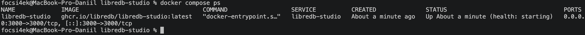
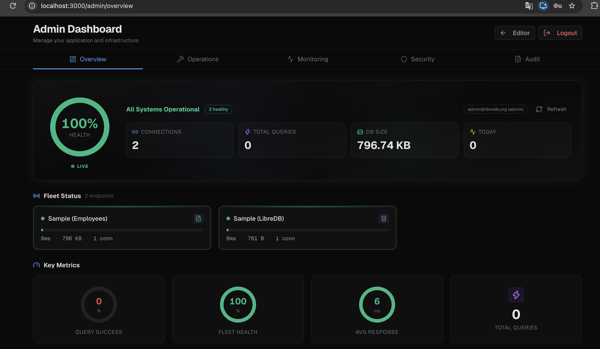

# 🧩 Развертывание LibreDB Studio с использованием Docker Compose

**Автор:** Абрамов Даниил Сергеевич

Проект демонстрирует развертывание **LibreDB Studio** в Docker-контейнере с использованием **Docker Compose**.

**LibreDB Studio** — веб-IDE с открытым исходным кодом для работы с базами данных через браузер. Он позволяет подключаться к БД, выполнять запросы, просматривать структуру данных, следить за состоянием подключений и администрировать базы без установки отдельного desktop-клиента.

После запуска LibreDB Studio доступен по адресу:

http://localhost:3000

---

## 📋 Требования

Перед началом работы необходимо убедиться, что установлены и запущены:

- Docker Desktop
- Docker Compose

Проверить существующие Docker Compose-проекты:

    docker compose ls

Проверить запущенные контейнеры:

    docker ps

Также желательно убедиться, что порт 3000 свободен.

Для macOS:

    lsof -i :3000

---

## 📁 1. Структура проекта

Структура проекта:

    libredb-studio/
    ├── README.md
    ├── compose.yaml
    ├── .env
    ├── 01-libredb-docker-ps.png
    └── 02-libredb-dashboard.png

Создание директории проекта:

    mkdir -p libredb-studio
    touch libredb-studio/compose.yaml
    cd libredb-studio

---

## ⚙️ 2. Настройка compose.yaml

Содержимое файла compose.yaml:

    services:
      libredb-studio:
        image: ghcr.io/libredb/libredb-studio:latest
        container_name: libredb-studio
        ports:
          - 3000:3000
        environment:
          ADMIN_EMAIL: ${ADMIN_EMAIL:-admin@libredb.org}
          ADMIN_PASSWORD: ${ADMIN_PASSWORD:?set ADMIN_PASSWORD in .env}
          JWT_SECRET: ${JWT_SECRET:?set JWT_SECRET in .env (min 32 chars)}
          STORAGE_PROVIDER: sqlite
          STORAGE_SQLITE_PATH: /app/data/libredb-storage.db
        volumes:
          - libredb-data:/app/data
        restart: unless-stopped
        healthcheck:
          test: ["CMD", "wget", "--spider", "-q", "http://localhost:3000"]
          interval: 30s
          timeout: 10s
          retries: 3
          start_period: 40s

    volumes:
      libredb-data:

---

## 🔐 3. Настройка .env

Для хранения параметров администратора и JWT-секрета создаётся файл .env:

    nano .env

Пример содержимого:

    ADMIN_EMAIL=admin@libredb.org
    ADMIN_PASSWORD=YourStrongPassword123!
    JWT_SECRET=your_generated_secret_here

Секрет можно сгенерировать командой:

    openssl rand -base64 32

После генерации вставить полученное значение в:

    JWT_SECRET=

> ⚠️ Файл .env не рекомендуется публиковать в GitHub, так как он содержит пароль и секретный ключ.

---

## ✅ 4. Проверка конфигурации

Перед запуском проекта рекомендуется проверить корректность файла Docker Compose:

    docker compose config

Если конфигурация составлена правильно, команда выведет итоговую структуру сервисов без ошибок.

---

## ▶️ 5. Запуск проекта

Запуск контейнера в фоновом режиме:

    docker compose up -d

После запуска проверить состояние:

    docker compose ps -a

В первые секунды может отображаться статус:

    health: starting

После завершения healthcheck статус должен измениться на:

    healthy

### Состояние контейнера

---

## 📜 6. Проверка логов

Посмотреть последние строки логов:

    docker compose logs --tail=20 libredb-studio

При успешном запуске в логах появляются сообщения о готовности приложения.

Например:

    LibreDB Studio 0.17.0
    Ready
    SQLite embedded sample seed completed

Просмотр логов в реальном времени:

    docker compose logs -f

Для выхода:

    Ctrl + C

---

## 🌐 7. Вход в LibreDB Studio

Открыть в браузере:

http://localhost:3000

Для входа использовать:

| Поле | Значение |
|---|---|
| Email | admin@libredb.org |
| Password | YourStrongPassword123! |

После успешной авторизации откроется административная панель LibreDB Studio.

---

## 📊 8. Панель администратора

После входа доступен Admin Dashboard, где отображаются:

- состояние системы
- количество подключений
- общее число запросов
- размер базы данных
- среднее время ответа
- статус подключённых баз
- системные метрики
- журнал активности

### Admin Dashboard

На скриншоте видно:

- статус 100% HEALTH
- All Systems Operational
- 2 healthy подключения
- Sample Employees
- Sample LibreDB
- статистику подключений и запросов

---

## 🗄️ 9. Хранение данных

LibreDB Studio использует SQLite для внутреннего хранения данных.

В compose.yaml указано:

    STORAGE_PROVIDER: sqlite

Путь внутри контейнера:

    /app/data/libredb-storage.db

Для сохранения данных используется Docker volume:

    libredb-data

Это позволяет сохранить настройки и внутреннюю базу после перезапуска контейнера.

---

## 🛠️ 10. Управление проектом

Все команды необходимо выполнять из директории libredb-studio.

### Проверить состояние

    docker compose ps

### Посмотреть все контейнеры

    docker ps -a

### Просмотреть логи

    docker compose logs

### Логи в реальном времени

    docker compose logs -f

### Остановить контейнер

    docker compose stop

### Запустить снова

    docker compose start

### Перезапустить

    docker compose restart

### Показать итоговую конфигурацию

    docker compose config

---

## ⏹️ 11. Остановка проекта

Для остановки и удаления контейнера и сети:

    docker compose down

Docker volume с данными при этом сохранится.

Для повторного запуска:

    docker compose up -d

---

## 🗑️ 12. Полное удаление проекта

Для удаления контейнера и данных:

    docker compose down -v

Параметр -v удалит volume libredb-data.

После этого можно удалить Docker-образ:

    docker image rm ghcr.io/libredb/libredb-studio:latest

Проверить, остались ли контейнеры:

    docker ps -a | grep libredb-studio

Проверить volumes:

    docker volume ls | grep libredb

Удалить каталог проекта:

    cd ..
    rm -rf libredb-studio

> ⚠️ Команда docker compose down -v полностью удалит внутренние данные LibreDB Studio.

---

## ⚠️ Возможные проблемы

### Порт 3000 занят

Проверить:

    lsof -i :3000

Если порт используется другим процессом, необходимо остановить его или изменить порт в compose.yaml.

Например:

    ports:
      - 3001:3000

После этого интерфейс будет доступен по адресу:

http://localhost:3001

---

### Контейнер долго находится в состоянии starting

Подождать около 40–60 секунд и проверить снова:

    docker compose ps

Также посмотреть логи:

    docker compose logs --tail=50 libredb-studio

---

## 🏗️ Архитектура проекта

                  ┌──────────────────────┐
                  │       Browser        │
                  │   localhost:3000     │
                  └──────────┬───────────┘
                             │
                             ▼
                  ┌──────────────────────┐
                  │    LibreDB Studio    │
                  │   Docker Container   │
                  │      port 3000       │
                  └──────────┬───────────┘
                             │
                             ▼
                  ┌──────────────────────┐
                  │        SQLite        │
                  │ libredb-storage.db   │
                  └──────────┬───────────┘
                             │
                             ▼
                  ┌──────────────────────┐
                  │     libredb-data     │
                  │    Docker Volume     │
                  └──────────────────────┘

---

## 📌 Итог

В рамках проекта был развернут **LibreDB Studio** с использованием Docker Compose.

Были выполнены:

- создание отдельного Docker-проекта
- настройка compose.yaml
- создание файла .env
- настройка административного пользователя
- генерация JWT-секрета
- запуск LibreDB Studio в контейнере
- публикация веб-интерфейса на порту 3000
- настройка постоянного хранения данных через Docker volume
- настройка healthcheck
- проверка логов
- вход в административную панель
- проверка состояния системы и подключений

LibreDB Studio позволяет работать с базами данных через браузер и может использоваться как веб-альтернатива desktop-инструментам администрирования.

---

## 🎯 Результат

LibreDB Studio успешно запущен локально и доступен по адресу:

http://localhost:3000

**Автор: Абрамов Даниил Сергеевич**