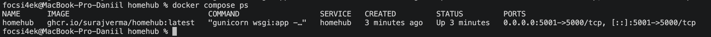
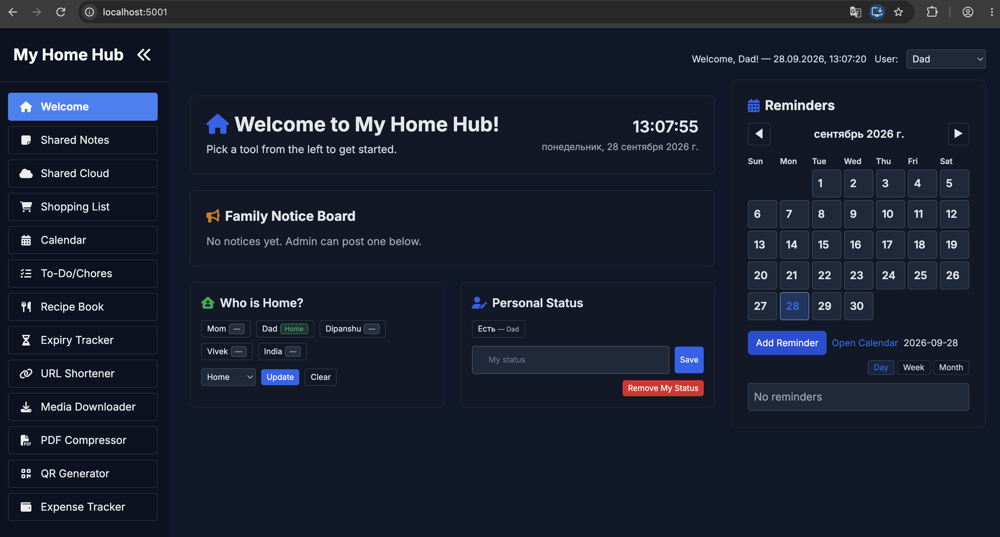

# 🏠 HomeHub в Docker Compose

**Автор:** Абрамов Даниил Сергеевич

Проект демонстрирует локальное развертывание **HomeHub** с использованием **Docker Compose**.

**HomeHub** — self-hosted веб-приложение для организации повседневных семейных дел. Оно позволяет создать единое приватное пространство для заметок, списков покупок, домашних задач, файлов, расходов, рецептов, напоминаний и других домашних сервисов.

Официальный проект:

https://github.com/surajverma/homehub

После запуска HomeHub доступен по адресу:

http://localhost:5001

---

## ✨ Возможности HomeHub

В приложении доступны:

- 🛒 списки покупок
- 📝 общие заметки
- ✅ домашние дела и задачи
- 👨‍👩‍👧‍👦 список членов семьи
- 📅 напоминания и календарь
- 💰 учёт семейных расходов
- 🍳 хранение рецептов
- ☁️ общее файловое хранилище
- 📱 генерация QR-кодов
- 📄 работа с PDF
- 🎞️ загрузка медиафайлов
- 📦 отслеживание сроков годности
- 🔗 сокращение ссылок
- 🏠 статус членов семьи
- 🌦️ погодный модуль

Набор функций можно включать и отключать через файл config.yml.

---

## 📋 Требования

Перед началом работы необходимо установить и запустить:

- Docker Desktop
- Docker Compose
- Git

Проверить запущенные Docker Compose-проекты:

    docker compose ls

Проверить активные контейнеры:

    docker ps

---

## 📥 1. Получение HomeHub

Клонирование официального репозитория:

    git clone --depth 1 https://github.com/surajverma/homehub.git

Переход в каталог проекта:

    cd homehub

Создание рабочего файла конфигурации на основе примера:

    cp config-example.yml config.yml

---

## 📁 2. Структура проекта

Основные файлы и каталоги проекта:

    homehub/
    ├── README.md
    ├── compose.yml
    ├── config.yml
    ├── config-example.yml
    ├── Dockerfile
    ├── app/
    ├── static/
    ├── templates/
    ├── uploads/
    ├── media/
    ├── pdfs/
    ├── data/
    ├── 01-homehub-docker-ps.png
    └── 02-homehub-dashboard.png

Основное назначение:

| Элемент | Назначение |
|---|---|
| compose.yml | Конфигурация Docker Compose |
| config.yml | Настройки HomeHub |
| config-example.yml | Пример конфигурации |
| uploads | Загруженные пользователями файлы |
| media | Медиафайлы |
| pdfs | PDF-файлы |
| data | Данные приложения |

---

## ⚙️ 3. Настройка Docker Compose

Используемая конфигурация:

    services:
      homehub:
        container_name: homehub
        image: ghcr.io/surajverma/homehub:latest
        ports:
          - 5001:5000
        environment:
          - FLASK_ENV=production
          - SECRET_KEY=${SECRET_KEY:-}
        volumes:
          - ./uploads:/app/uploads
          - ./media:/app/media
          - ./pdfs:/app/pdfs
          - ./data:/app/data
          - ./config.yml:/app/config.yml:ro

### Используемые параметры

| Параметр | Значение |
|---|---|
| Docker-образ | ghcr.io/surajverma/homehub:latest |
| Имя контейнера | homehub |
| Внешний порт | 5001 |
| Внутренний порт | 5000 |
| Режим | production |

---

## 🔌 Почему используется порт 5001

По умолчанию HomeHub предполагает использование порта 5000.

На используемом macOS порт 5000 уже был занят системным процессом, что было проверено командой:

    lsof -i :5000

Поэтому внешний порт был изменён:

    5001:5000

HomeHub внутри контейнера по-прежнему работает на порту 5000, а с компьютера приложение открывается через:

http://localhost:5001

---

## 📝 4. Настройка config.yml

Файл config.yml используется для настройки интерфейса и возможностей HomeHub.

Пример базовых параметров:

    instance_name: "My Home Hub"
    password: ""
    admin_name: "Administrator"

Если поле password оставлено пустым, приложение доступно без пароля.

### Управление функциями

В секции feature_toggles можно включать и отключать отдельные возможности:

    feature_toggles:
      shopping_list: true
      media_downloader: true
      pdf_compressor: true
      qr_generator: true
      notes: true
      shared_cloud: true
      who_is_home: true
      personal_status: true
      chores: true
      recipes: true
      expiry_tracker: true
      url_shortener: true
      expense_tracker: true
      calendar: true

---

## 👨‍👩‍👧‍👦 Члены семьи

Список пользователей можно изменить в config.yml:

    family_members:
      - Mom
      - Dad
      - Dipanshu
      - Vivek
      - India

При необходимости значения можно заменить на собственные.

---

## 🎨 Настройка оформления

HomeHub позволяет изменять цветовую тему интерфейса:

    theme:
      primary_color: "#1d4ed8"
      secondary_color: "#a0aec0"
      background_color: "#f7fafc"
      card_background_color: "#fff"
      text_color: "#333"
      sidebar_background_color: "#2563eb"

Таким образом интерфейс можно адаптировать под собственный стиль.

---

## ▶️ 5. Запуск HomeHub

Перед запуском можно проверить конфигурацию:

    docker compose config

Запуск контейнера в фоновом режиме:

    docker compose up -d

Проверка состояния:

    docker compose ps

После успешного запуска отображается контейнер:

    homehub

со статусом:

    Up

и пробросом портов:

    5001 -> 5000

---

## ✅ Состояние контейнера

На скриншоте видно, что контейнер HomeHub успешно запущен и приложение доступно через порт 5001.

---

## 🌐 6. Открытие HomeHub

После запуска открыть в браузере:

http://localhost:5001

При пустом значении password дополнительная авторизация не требуется.

---

## 🏠 Интерфейс HomeHub

После запуска доступна единая семейная панель со всеми включёнными модулями приложения.

---

## 📜 7. Просмотр логов

Показать логи приложения:

    docker compose logs

Просматривать логи в реальном времени:

    docker compose logs -f

Для выхода:

    Ctrl + C

Показать последние строки:

    docker compose logs --tail=30 homehub

---

## 🛠️ 8. Управление контейнером

### Проверить состояние

    docker compose ps

### Остановить HomeHub

    docker compose stop

При этом контейнер не удаляется.

### Запустить снова

    docker compose start

### Перезапустить

    docker compose restart

### Посмотреть конфигурацию

    docker compose config

### Посмотреть все контейнеры

    docker ps -a

---

## 💾 9. Хранение данных

Для хранения данных используются локальные директории проекта:

    ./uploads
    ./media
    ./pdfs
    ./data

Они подключаются непосредственно внутрь контейнера.

Это позволяет сохранять пользовательские данные даже после остановки или пересоздания контейнера.

Например:

    ./data:/app/data

означает, что данные приложения сохраняются непосредственно в каталоге data проекта.

---

## 🗑️ 10. Удаление проекта

Остановить и удалить контейнер:

    docker compose down

Если требуется также удалить используемые Docker-ресурсы:

    docker compose down --rmi all -v

После этого выйти из каталога:

    cd ..

Удалить папку:

    rm -rf homehub

Проверить оставшиеся контейнеры:

    docker ps -a

Проверить образы:

    docker images

---

## ⚠️ Важный момент

В данном проекте пользовательские данные хранятся не только в Docker volumes, но и в локальных папках проекта.

Поэтому команда:

    docker compose down -v

сама по себе не удаляет файлы из каталогов:

    uploads/
    media/
    pdfs/
    data/

Полное удаление этих данных произойдёт после удаления каталога homehub.

---

## 🏗️ Архитектура проекта

                  ┌────────────────────────┐
                  │        Browser         │
                  │    localhost:5001      │
                  └────────────┬───────────┘
                               │
                               ▼
                  ┌────────────────────────┐
                  │        HomeHub         │
                  │    Docker Container    │
                  │       port 5000        │
                  └────────────┬───────────┘
                               │
             ┌─────────────────┼─────────────────┐
             │                 │                 │
             ▼                 ▼                 ▼
          uploads/           media/            pdfs/
             │
             ▼
           data/
             │
             ▼
        Данные приложения

---

## 🔄 Схема подключения портов

    Browser
       │
       │ http://localhost:5001
       ▼
    macOS :5001
       │
       │ Docker port mapping
       ▼
    HomeHub :5000

---

## ⚠️ Возможные проблемы

### Порт 5000 уже используется

Проверить:

    lsof -i :5000

Если порт занят, можно использовать другой внешний порт:

    ports:
      - 5001:5000

После этого приложение открывается:

http://localhost:5001

---

### HomeHub не открывается

Проверить контейнер:

    docker compose ps

Посмотреть логи:

    docker compose logs --tail=50 homehub

При необходимости перезапустить:

    docker compose restart

---

### Контейнер остановлен

Запустить:

    docker compose start

И снова проверить:

    docker compose ps

---

## 📌 Итог

В рамках проекта был локально развернут **HomeHub** с использованием Docker Compose.

В процессе работы были выполнены:

- клонирование официального репозитория HomeHub
- создание рабочего файла config.yml
- настройка функциональных модулей приложения
- запуск HomeHub в Docker-контейнере
- использование готового Docker-образа из GitHub Container Registry
- настройка локальных каталогов для постоянного хранения данных
- изменение внешнего порта с 5000 на 5001
- проверка состояния контейнера
- просмотр логов приложения
- открытие HomeHub через браузер

Docker Compose позволяет быстро развернуть HomeHub как локальный семейный сервис без ручной установки Python, Flask и остальных зависимостей приложения.

---

## 🎯 Результат

HomeHub успешно работает в Docker-контейнере и доступен локально по адресу:

http://localhost:5001

**Автор: Абрамов Даниил Сергеевич**

---

> Проект основан на open-source приложении HomeHub:  
> https://github.com/surajverma/homehub
