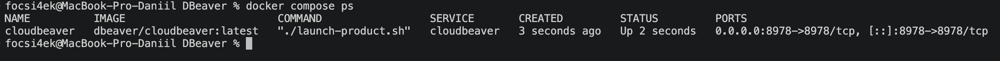
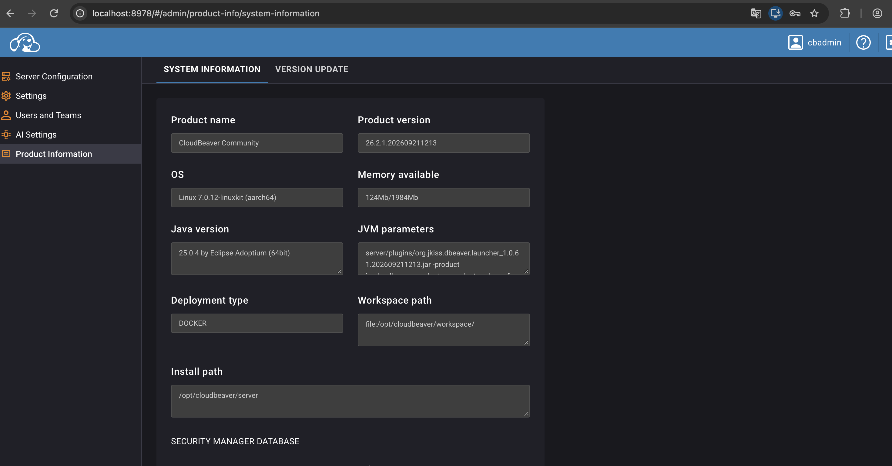

# 🦫 Развертывание CloudBeaver с использованием Docker Compose

**Автор:** Абрамов Даниил Сергеевич

Проект демонстрирует локальное развертывание **CloudBeaver** с использованием **Docker Compose**.

**CloudBeaver** — веб-версия популярного инструмента **DBeaver**, предназначенная для работы с базами данных через браузер.

После запуска приложение доступно по адресу:

http://localhost:8978

---

## 📋 Требования

Перед началом работы необходимо убедиться, что установлены и запущены:

- Docker Desktop
- Docker Compose

Проверить существующие Docker Compose-проекты:

    docker compose ls

Проверить запущенные контейнеры:

    docker ps

Также желательно убедиться, что порт 8978 свободен:

    lsof -i :8978

---

## 📁 1. Структура проекта

Структура проекта:

    DBeaver/
    ├── README.md
    ├── compose.yaml
    ├── workspace/
    ├── 01-cloudbeaver-docker-ps.png
    └── 02-cloudbeaver-dashboard.png

Создание каталога проекта:

    mkdir -p DBeaver
    cd DBeaver
    touch compose.yaml

---

## ⚙️ 2. Настройка compose.yaml

Содержимое файла compose.yaml:

    services:
      cloudbeaver:
        image: dbeaver/cloudbeaver:latest
        container_name: cloudbeaver
        restart: unless-stopped
        ports:
          - 8978:8978
        volumes:
          - ./workspace:/opt/cloudbeaver/workspace

---

## 🧩 Используемые параметры

| Параметр | Значение |
|---|---|
| Docker-образ | dbeaver/cloudbeaver:latest |
| Имя контейнера | cloudbeaver |
| Локальный порт | 8978 |
| Порт контейнера | 8978 |
| Рабочая директория | ./workspace |

Каталог workspace используется для хранения настроек, подключений и конфигурации CloudBeaver.

---

## ▶️ 3. Запуск проекта

Перед запуском можно проверить корректность конфигурации:

    docker compose config

Запуск контейнера в фоновом режиме:

    docker compose up -d

Проверка состояния:

    docker compose ps

После успешного запуска контейнер cloudbeaver должен иметь статус Up.

### Состояние контейнера

---

## 🌐 4. Открытие CloudBeaver

После запуска необходимо открыть в браузере:

http://localhost:8978

При первом запуске CloudBeaver предложит пройти первоначальную настройку.

---

## 👤 5. Создание администратора

В мастере настройки необходимо создать администратора.

Пример:

| Поле | Значение |
|---|---|
| Login | cbadmin |
| Password | собственный пароль |

Пароль должен:

- содержать не менее 8 символов
- включать хотя бы одну заглавную букву
- включать хотя бы одну строчную букву

После завершения настройки можно войти в CloudBeaver под созданной учетной записью.

---

## ✅ 6. Результат

После успешного входа открывается веб-интерфейс CloudBeaver.

### Панель CloudBeaver

CloudBeaver готов к созданию подключений к базам данных и дальнейшей работе через браузер.

---

## 📜 7. Просмотр логов

Показать логи контейнера:

    docker compose logs cloudbeaver

Просматривать логи в реальном времени:

    docker compose logs -f cloudbeaver

Для выхода:

    Ctrl + C

---

## 🛠️ 8. Управление проектом

### Проверить состояние

    docker compose ps

### Показать все контейнеры проекта

    docker compose ps -a

### Остановить сервис

    docker compose stop

### Запустить остановленный сервис

    docker compose start

### Перезапустить

    docker compose restart

### Показать итоговую конфигурацию

    docker compose config

---

## 💻 9. Вход в контейнер

Для входа в контейнер CloudBeaver:

    docker compose exec cloudbeaver bash

Если bash недоступен:

    docker compose exec cloudbeaver sh

Для выхода:

    exit

---

## 💾 10. Хранение данных

CloudBeaver сохраняет настройки в локальной папке:

    ./workspace

Она подключается внутрь контейнера:

    /opt/cloudbeaver/workspace

Поэтому после остановки и повторного запуска контейнера настройки сохраняются.

Обычная команда:

    docker compose down

не удаляет папку workspace.

---

## 🗑️ 11. Удаление проекта

Остановить и удалить контейнер:

    docker compose down

При необходимости удалить Docker volume:

    docker compose down -v

В данном проекте основные данные хранятся в локальной папке workspace, поэтому удаление volume не удалит её содержимое.

Удалить Docker-образ:

    docker image rm dbeaver/cloudbeaver:latest

После этого выйти из каталога:

    cd ..

Удалить папку проекта:

    rm -rf DBeaver

---

## ⚠️ Возможные проблемы

### Порт 8978 уже занят

Проверить:

    lsof -i :8978

Если порт используется другим процессом, можно изменить внешний порт.

Например:

    ports:
      - 8979:8978

После этого CloudBeaver будет доступен по адресу:

http://localhost:8979

---

### CloudBeaver не открывается

Проверить состояние контейнера:

    docker compose ps

Посмотреть логи:

    docker compose logs --tail=50 cloudbeaver

При необходимости перезапустить:

    docker compose restart

---

## 🏗️ Архитектура проекта

                  ┌──────────────────────┐
                  │       Browser        │
                  │   localhost:8978     │
                  └──────────┬───────────┘
                             │
                             ▼
                  ┌──────────────────────┐
                  │     CloudBeaver      │
                  │  Docker Container    │
                  │      port 8978       │
                  └──────────┬───────────┘
                             │
                             ▼
                  ┌──────────────────────┐
                  │      workspace       │
                  │ локальные настройки │
                  └──────────────────────┘

---

## 📌 Итог

В рамках проекта был развернут **CloudBeaver** с использованием Docker Compose.

Были выполнены:

- создание отдельного каталога проекта
- настройка compose.yaml
- загрузка официального Docker-образа
- запуск CloudBeaver в контейнере
- проброс порта 8978
- создание администратора
- открытие веб-интерфейса через браузер
- сохранение настроек в локальной папке workspace
- проверка состояния контейнера
- просмотр логов приложения

CloudBeaver позволяет работать с базами данных через браузер без установки desktop-версии DBeaver.

---

## 🎯 Результат

CloudBeaver успешно запущен локально и доступен по адресу:

http://localhost:8978

**Автор: Абрамов Даниил Сергеевич**