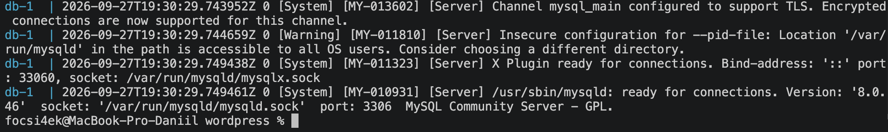
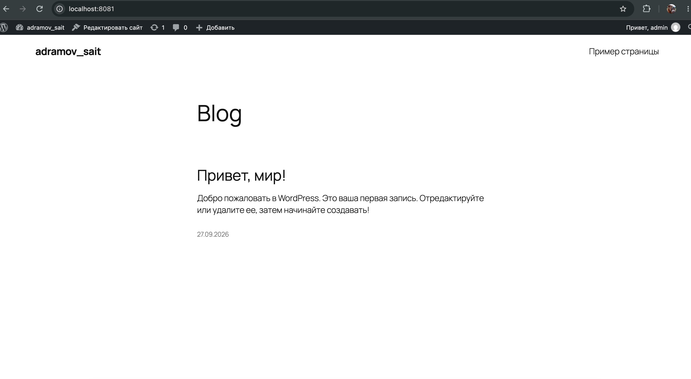
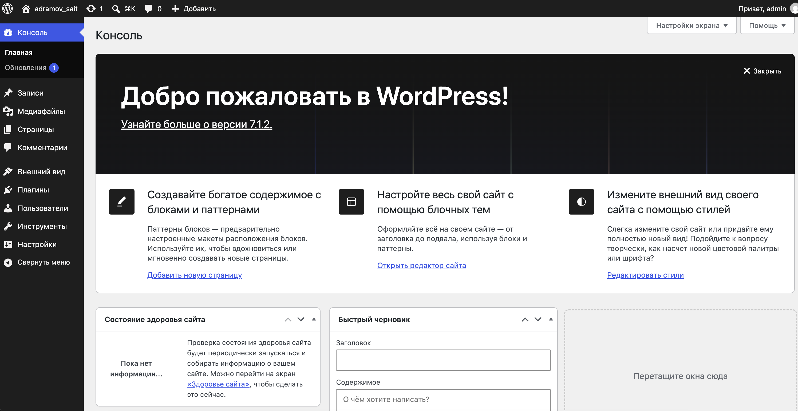

# 🚀 Развертывание WordPress с использованием Docker Compose

**Автор:** Абрамов Даниил Сергеевич

Проект демонстрирует развертывание CMS **WordPress** с использованием **Docker Compose** и базы данных **MySQL**.

**WordPress** — одна из самых популярных систем управления контентом с открытым исходным кодом. Платформа написана на PHP и может использоваться для создания блогов, корпоративных сайтов, интернет-магазинов и других веб-проектов.

В результате запускаются два контейнера:

- **WordPress** — веб-приложение
- **MySQL** — база данных

После запуска сайт будет доступен по адресу:

[http://localhost:8081](http://localhost:8081)

---

## 📋 Требования

Перед началом работы необходимо убедиться, что установлен и запущен **Docker Desktop**.

Проверить существующие Docker Compose-проекты можно командой:

    docker compose ls

Если другие проекты уже запущены, рекомендуется проверить используемые ими порты, чтобы избежать конфликтов.

---

## 📁 1. Создание проекта

Структура проекта:

    wordpress/
    ├── README.md
    ├── compose.yaml
    ├── 01-wordpress-docker-ps.png
    ├── 02-wordpress-frontend.png
    ├── 03-wordpress-admin.png
    └── 04-wordpress-db-logs.png

Создание директории проекта и файла конфигурации через терминал macOS:

    mkdir -p wordpress
    touch wordpress/compose.yaml
    cd wordpress

---

## ⚙️ 2. Настройка compose.yaml

Содержимое файла:

    services:
      db:
        image: mysql:8.0
        restart: unless-stopped
        environment:
          MYSQL_ROOT_PASSWORD: somewordpress
          MYSQL_DATABASE: wordpress
          MYSQL_USER: wordpress
          MYSQL_PASSWORD: wordpress
        volumes:
          - db_data:/var/lib/mysql
        networks:
          - wp-network

      wordpress:
        depends_on:
          - db
        image: wordpress:latest
        ports:
          - 8081:80
        restart: unless-stopped
        environment:
          WORDPRESS_DB_HOST: db:3306
          WORDPRESS_DB_USER: wordpress
          WORDPRESS_DB_PASSWORD: wordpress
          WORDPRESS_DB_NAME: wordpress
        volumes:
          - wordpress_data:/var/www/html
        networks:
          - wp-network

    networks:
      wp-network:

    volumes:
      db_data:
      wordpress_data:

### Используемые сервисы

| Сервис | Docker-образ | Назначение |
|---|---|---|
| db | mysql:8.0 | База данных MySQL |
| wordpress | wordpress:latest | CMS WordPress |

Порт 80 контейнера WordPress пробрасывается на локальный порт 8081.

> ⚠️ Пароли в данном проекте используются в учебных целях. В реальном проекте конфиденциальные данные рекомендуется хранить отдельно, например в файле .env.

---

## ▶️ 3. Запуск проекта

Запуск всех сервисов в фоновом режиме:

    docker compose up -d

Проверка состояния контейнеров:

    docker compose ps

После успешного запуска контейнеры должны иметь статус Up.

### Статус запущенных контейнеров

---

## 🗄️ Проверка базы данных MySQL

Для просмотра логов базы данных выполнить:

    docker compose logs db

В логах можно убедиться, что сервер MySQL успешно запущен и готов принимать подключения.

---

## 🌐 4. Установка WordPress

После запуска контейнеров необходимо открыть браузер и перейти по адресу:

[http://localhost:8081](http://localhost:8081)

Откроется мастер установки WordPress.

### Этапы установки

1. Выбрать язык системы
2. Указать название сайта
3. Создать учетную запись администратора
4. Указать адрес электронной почты
5. Установить пароль
6. Завершить установку
7. Выполнить вход в административную панель

---

## ✅ 5. Результат

После завершения установки главная страница сайта будет доступна по адресу:

[http://localhost:8081](http://localhost:8081)

### Главная страница WordPress

### Панель администратора

Административная панель WordPress доступна по адресу:

[http://localhost:8081/wp-admin](http://localhost:8081/wp-admin)

---

## 🛠️ 6. Управление проектом

Все команды необходимо выполнять из директории проекта wordpress.

### Просмотр логов WordPress

    docker compose logs -f wordpress

Для выхода из режима просмотра логов:

    Ctrl + C

### Просмотр логов MySQL

    docker compose logs -f db

Для выхода:

    Ctrl + C

### Просмотр состояния контейнеров

    docker compose ps

### Остановка контейнеров

    docker compose stop

Контейнеры будут остановлены, но данные WordPress и базы данных сохранятся.

### Запуск остановленных контейнеров

    docker compose start

### Перезапуск проекта

    docker compose restart

---

## 🗑️ 7. Удаление проекта

Для остановки контейнеров и полного удаления Docker volumes:

    docker compose down -v

Параметр -v удаляет тома db_data и wordpress_data.

Это означает, что база данных и файлы WordPress будут полностью удалены.

Для удаления рабочей директории проекта:

    cd ..
    rm -rf wordpress

---

## 🏗️ Архитектура проекта

                  ┌─────────────────────┐
                  │       Browser       │
                  └──────────┬──────────┘
                             │
                    localhost:8081
                             │
                             ▼
                  ┌─────────────────────┐
                  │      WordPress      │
                  │ wordpress:latest    │
                  │       port 80       │
                  └──────────┬──────────┘
                             │
                       wp-network
                             │
                             ▼
                  ┌─────────────────────┐
                  │       MySQL         │
                  │     mysql:8.0       │
                  │     port 3306       │
                  └─────────────────────┘

---

## 📌 Итог

В рамках проекта была развернута CMS **WordPress** с использованием Docker Compose.

Были настроены:

- контейнер WordPress
- контейнер MySQL
- внутренняя Docker-сеть
- постоянное хранение данных через Docker volumes
- подключение WordPress к MySQL
- доступ к сайту через локальный порт 8081
- доступ к административной панели WordPress

Использование Docker позволяет быстро развернуть WordPress без отдельной ручной установки PHP, веб-сервера и MySQL.

---

**Автор:** Абрамов Даниил Сергеевич